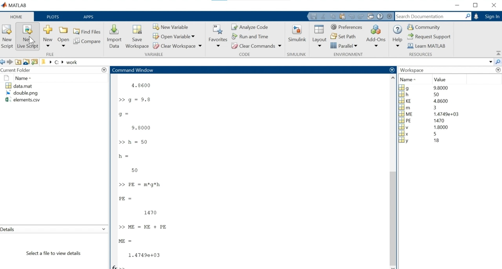
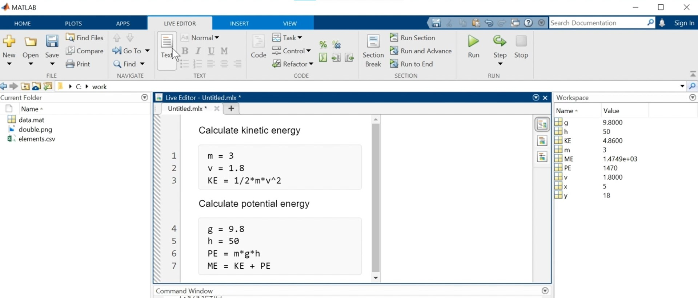
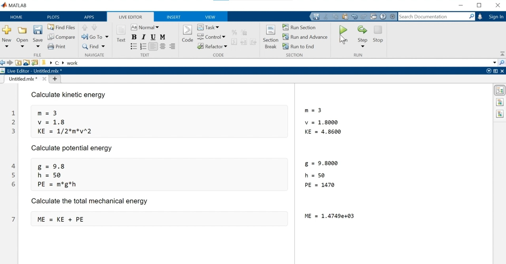
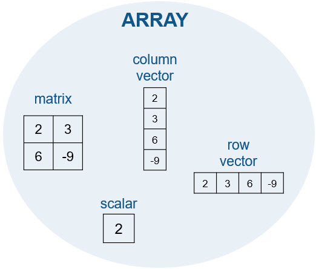

# Intro a Matlab

## Comandos

### Introducción de comandos

Si se agrega un punto y coma al final de un comando, se suprime la salida, aunque el comando seguirá ejecutándose

```matlab
>> x = 5 + 1
x = 
    6

>> x = 5 + 1;
```

Cuando se introduce solo el nombre de una variable en la línea de comandos, MATLAB devuelve el valor actual de esa variable.

### Denominación de las variables

Puede asignar a sus variables de MATLAB el nombre que desee, siempre que empiece por una letra y contenga solo letras, números y guiones bajos (_).

+ En las variables de MATLAB también se distingue entre mayúsculas y minúsculas.

+ Puede nombrar todas sus variables como a o x, pero es más útil utilizar un nombre significativo.

+ Si utiliza un nombre de variable no válido, MATLAB mostrará una sugerencia de corrección.

### Almacenamiento y carga de variables

Puede guardar variables en su espacio de trabajo en un formato de archivo específico de MATLAB, llamado archivo MAT, usando el comando `save`.

+ Para guardar el espacio de trabajo en un archivo MAT llamado `foo.mat`, utilice el comando:

```matlab
>> save foo
```

Cuando cambie a un nuevo problema en MATLAB, puede que tenga que ordenar el espacio de trabajo. Puede eliminar todas las variables del espacio de trabajo con la función `clear`.

Puede usar `clc` para vaciar Command Window (Ventana de comandos).

Puede cargar variables de un archivo MAT usando el comando load.

```matlab
>> load foo
```

Al cerrar MATLAB, el espacio de trabajo se vaciará. Los archivos MAT se pueden emplear para guardar variables. Después, las variables se pueden cargar en el espacio de trabajo cuando se vuelva a abrir MATLAB.

Si desea cargar o guardar solo algunas de las variables, puede utilizar dos entradas para las funciones. Intente cargar solo la variable m del archivo myData.mat:

```matlab
>> load myData m4
```

Luego, intente guardar la variable m en un nuevo archivo MAT llamado justm.mat:

```matlab
>> save justm m
```

### Uso de constantes y funciones incorporadas

MATLAB contiene constantes incorporadas, como pi para representar `π`.

```matlab
>> a = pi
a = 
    3.1416
```

Además, aunque solo se muestran cuatro decimales para π, se representa internamente con mayor precisión.

Puede controlar la precisión visualizada con la función `format`.

+ Con `format short` se vuelve a la visualización predeterminada.

```matlab
>> format long
>> a
a =
    3.141592653589793
```

MATLAB contiene una amplia variedad de funciones incorporadas, como abs (valor absoluto) y eig (cálculo de valores propios).

```matlab
>> a = sin(-5)
a = 
    0.9589
```

Observe que MATLAB utiliza paréntesis para pasar las entradas a las funciones, de forma similar a la notación matemática estándar.

```matlab
>> z = sqrt(-9)
z =
    0.0000 + 3.0000i
```

Observe que la solución contiene el número imaginario, i, que es una constante incorporada de MATLAB.

## Live Scripts

Crear un nuevo live script:



El codigo se agrega en el área gris y se pueden agregar descripciones cambiando a modo texto:



Los botones de la derecha sirven para cambiar el diseño del script. Con "Run Section" se evalúa solamente la sección señalada, y con el botón "Run" se evalúan todos los comandos en orden:



Al salvar el script, se guardan el código, la salida y las descripciones, y se puede compartir el documento interactivo con otros usuarios de MATLAB.

+ Para compartir los resultados con cualquier persona, usuario de MATLAB o no, se puede guardar el script como un documento en PDF o HTML estático.

## Vectores y matrices

### Introducción manual de arreglos

#### ¿Qué es un arreglo?

Todas las variables de MATLAB son arreglos. Esto significa que cada variable puede contener múltiples elementos. Se pueden utilizar arreglos para almacenar datos relacionados en una variable.

Debido a que usará arreglos cada vez que programe, es importante conocer los arreglos y la terminología utilizada para describirlos.



+ Un solo número, llamado escalar, es en realidad un arreglo de 1 por 1, lo que significa que contiene 1 fila y 1 columna.

Puede crear arreglos con varios elementos utilizando corchetes.

```matlab
x = [3 5]
x = 
    3    5
```

+ Existe cierta flexibilidad cuando se crean arreglos. Por ejemplo, todas estas son formas válidas de crear el mismo arreglo:

```matlab
x = [7 9]
x=[7,9]
x = [7, 9]
```

Cuando se separan los números con espacios (o comas), MATLAB combina los números en un vector fila, que es un arreglo con una fila y varias columnas (1 por n). Cuando se separan los números mediante punto y coma, MATLAB crea un vector columna (n por 1).

```matlab
x = [1;3]
x = 
    1
    3
```

Puede combinar espacios con punto y coma para crear una matriz, que es un arreglo con varias filas y columnas. Cuando se introduce una matriz, se debe introducir línea por línea.

```matlab
x = [3 4 5;6 7 8]
x = 
    3    4    5
    6    7    8
```

En MATLAB, puede realizar cálculos entre los corchetes.

```matlab
x = [abs(-4) 4^2]
x = 
     4    16
```

### Creación de vectores con espaciado uniforme

Para vectores largos, introducir números individuales no es práctico. Un método alternativo y abreviado para crear vectores uniformemente espaciados es utilizar el operador : y especificar solo los puntos de inicio y fin.

```matlab
y = 5:8
y = 
    5    6    7    8
```

Observe que los corchetes no son necesarios cuando se utiliza el operador de dos puntos.

El operador : utiliza un espaciado predeterminado de 1, pero puede especificar su propio espaciado, como se muestra a continuación.

```matlab
x = 20:2:26
x = 
    20    22    24    26
```

Si conoce el número de elementos que desea en un vector (en lugar del espaciado entre cada elemento), podría utilizar en su lugar la función `linspace`:

    linspace(primero,último,número_de_elementos).

Observe el uso de comas (,) para separar las entradas de la función linspace.

```matlab
x = linspace(0,1,5)
x = 
    0    0.250    0.500    0.750    1.000
```

Tanto linspace como el operador : crean vectores fila. Sin embargo, puede convertir un vector fila en un vector columna utilizando el operador de trasposición (').

```matlab
x = 1:3;
x = x'
x = 
    1
    2
    3
```

Puede crear vectores columna en un solo comando si crea el vector fila y lo traspone todo en una línea. Observe el uso de paréntesis aquí para especificar el orden de las operaciones.

```matlab
x = (1:2:5)'
x = 
    1
    3
    5
```

### Funciones de creación de arreglos

MATLAB contiene muchas funciones que lo ayudan a crear matrices de uso habitual, como matrices de números aleatorios.

```matlab
x = rand(2)
x = 
    0.8147    0.1270
    0.9058    0.9134
```

Observe que el 2 en el comando rand(2) especifica que la salida será una matriz de 2 por 2 de números aleatorios.

Muchas funciones de creación de matrices permiten introducir un número para crear una matriz cuadrada (n por n) o introducir dos números para crear matrices no cuadradas.

```matlab
x = rand(2)
x = 
    0.8147    0.1270
    0.9058    0.9134

x = zeros(6,3)
x = 
    0    0    0
    0    0    0
    0    0    0
    0    0    0
    0    0    0
    0    0    0
```

¿Cómo se obtiene el tamaño de una matriz existente? Puede utilizar la función `size`.

```matlab
size(x)
ans = 
    6    3
```

También puede crear una matriz con el mismo tamaño que una matriz existente en una línea de código.

```matlab
rand(size(x))
```

## Indexación y modificación de arreglos

### Indexación en arreglos

### Extracción de varios elementos

### Modificación de valores en los arreglos

## Cálculos en arreglos

### Realización de operaciones de arreglos en vectores

## Llamadas a funciones

### Obtención de varias salidas de las funciones

## Cómo obtener ayuda

## Representación gráfica de datos

### Representación gráfica de vectores

### Anotación de gráficas

## Revisión de problemas

### Proyecto: Consumo eléctrico

### Proyecto: Frecuencia de audio

## Importación de datos

### Herramienta de importación

### Importación de datos como una tabla

## Arreglos lógicos

### Indexación lógica

## Programación

### Construcciones de programación

### Ramificaciones de decisión

### Bucles for

## Proyecto final

### Proyecto: Movimiento estelar

### Proyecto: Movimiento estelar II
