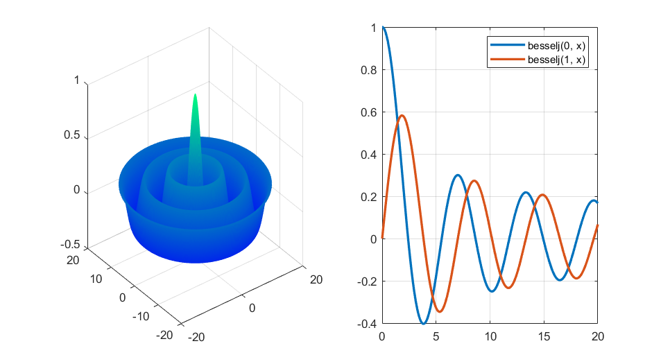

# Case Study: Surface Waves (Bessel's Function)

For a cylindrical container, the shape of standing waves is described using a special function called '[Bessel’s function](https://en.wikipedia.org/wiki/Bessel_function) of the first kind of order zero', which is denoted `J`<sub>`0`</sub>`(x)`. The locations of the peaks and valleys of these surface waves (the extrema) are often important in applications and can be found where the slope of `J`<sub>`0`</sub>`(x)` is zero.  is zero.  Luckily, it is known that `dJ`<sub>`0`</sub>`(x) / dx = -J`<sub>`1`</sub>`(x)`, where `J`<sub>`1`</sub>`(x)` is Bessel’s function of the first kind of order one.



## Script

```matlab
r = zeros(1,6);
J = zeros(1,6);

% Define the function handles.
bessel0 = @(x) besselj(0, x);
bessel1 = @(x) besselj(1, x);

% Set the arguments for FZERO.
options = optimset('Display','none','TolX',1e-8);

% Find the first 6 extrema using FZERO.
r(1) = fzero(bessel1, 0, options);
r(2) = fzero(bessel1, 3.5, options);
r(3) = fzero(bessel1, 7, options);
r(4) = fzero(bessel1, 10, options);
r(5) = fzero(bessel1, 13.5, options);
r(6) = fzero(bessel1, 16.5, options);
J = bessel0(r);

%%%%%%%%%%%  Plot the function and the extrema %%%%%%%%%%.
% Define the x values.
x = 0:0.1:25;
figure; hold on; grid on;
plot(x,bessel0(x))
plot(x,bessel1(x)),
plot(r,J,'rx');
plot(r,0*r,'bo');
axis([0 max(x) -1 1]);
xlabel('x');
legend({'$J_0(x)$','$J_1(x)$'},'Interpreter','latex')

% Print the results.
fprintf('x-location of extrema of Bessel''s function of the first kind of order zero:\n');
fprintf('  Extrema(%d) at x = %12.8f\n',[1:length(r);r]);

```